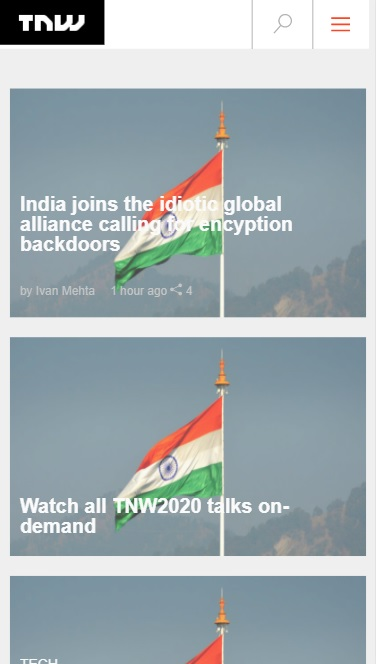

# The Next Web Clone

In this project, we would be working on a clone of TNW and making it responsive to fit any kind of screen. This project would be done by Alan Solis and Adesuyi Adetola.

## The Next Web Clone with the following features:

- Responsiveness

- Backgrounds features

- Flexbox, grid, floats, and articles

- Media queries for bigger screen sizes

## Built With

- HTML

- CSS/SCSS

## Live Demo

[Live Demo Link](https://rawcdn.githack.com/Arinpe/TNW/86c42e85ad7501dee70ff3e04a4c947955944f67/index.html)

**See the page via the link above**

**See the Source Page via the link below**

[Source Page Link](https://thenextweb.com/)

## Authors

👤 **Adetola Adesuyi**

- GitHub: [@Arinpe](https://github.com/Arinpe)
- Twitter: [@_detola_](https://twitter.com/_detola_)
- LinkedIn: [LinkedIn](https://www.linkedin.com/in/adesuyi-adetola-7b4451111/)

👤 **Alan Solis**

- GitHub: [@github](https://github.com/warblo001)
- Twitter: [@twitter](https://twitter.com/Alan55572391)
- LinkedIn: [LinkedIn](https://www.linkedin.com/in/alan-solis-b567b044/)

## Show your support

Give a ⭐️ if you like this project!

## 📝 License

This project is [MIT](LICENSE) licensed.
